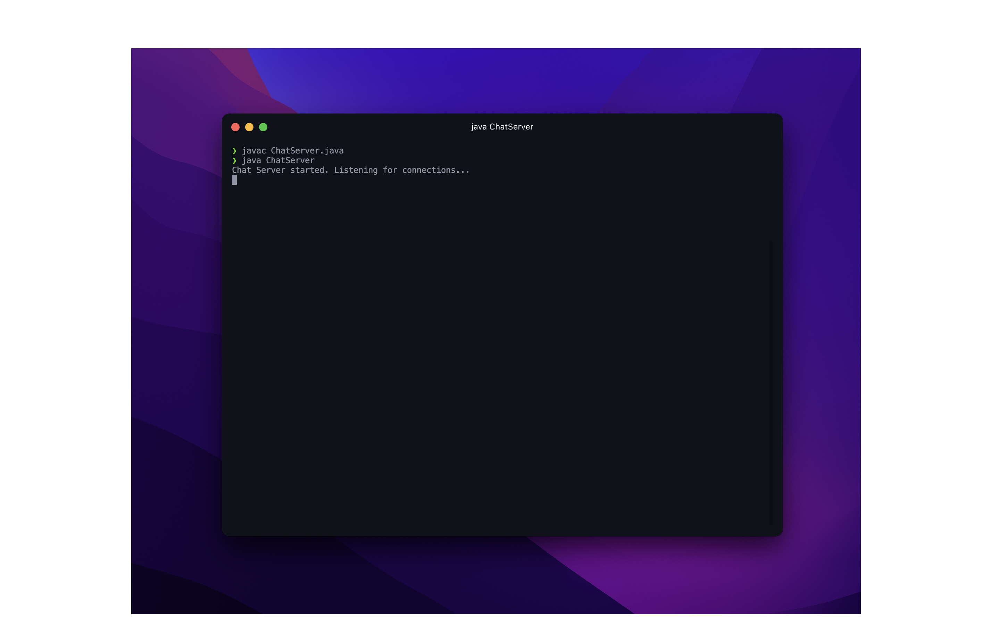
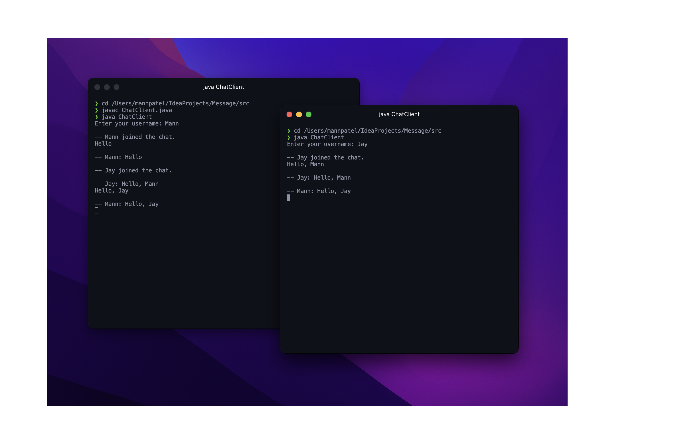

# Java Server Chat Application

## Purpose
This project is a simple Java-based chatting application that demonstrates how to create a basic server-client architecture to facilitate real-time communication between multiple clients. The server accepts incoming connections from clients and broadcasts messages received from one client to all connected clients, allowing them to chat with each other.

The main objectives of this project are:
- Learn how to implement a simple server in Java.
- Understand the basics of creating a client-server architecture for real-time communication.
- Demonstrate socket programming in Java.

## Prerequisites
To run this chat application, you need the following:
- Java Development Kit (JDK) installed on your machine.
- An integrated development environment (IDE) such as IntelliJ IDEA or Eclipse (optional but recommended).

## How to Use in Terminal
1. Clone this repository to your local machine or download the ZIP file and extract it.
2. Open your terminal or command prompt.
3. Navigate to the src directory.
4. Compile the Java files using the following commands:
   ```javac ChatServer.java```
   ```javac ChatClient.java```
5. Start the chat server by running the following command:
   ```java ChatServer```
6. To stop the chat server yse the following keyboard command ` ^ Control + C`
7. In a separate terminal window, start the chat client(s) by running the following command:
   ```java ChatClient```
8. To use multiple clients just start the client code in a new termianl window.
9. Now, you can start chatting with other clients connected to the server through the terminal.

## Screenshots

*Description: Screenshot of the chat server running in the terminal.*


*Description: Screenshot of a chat client running in the terminal.*

## Notes
- For client code in the RouterTerminalChat directory
  - The server IP address in the `ChatClient.java` file should be replaced with the actual public IP address of the machine where the server is running.
- This is a basic implementation and lacks some features like error handling and security. It is recommended to enhance it for production-level use.

Happy chatting!